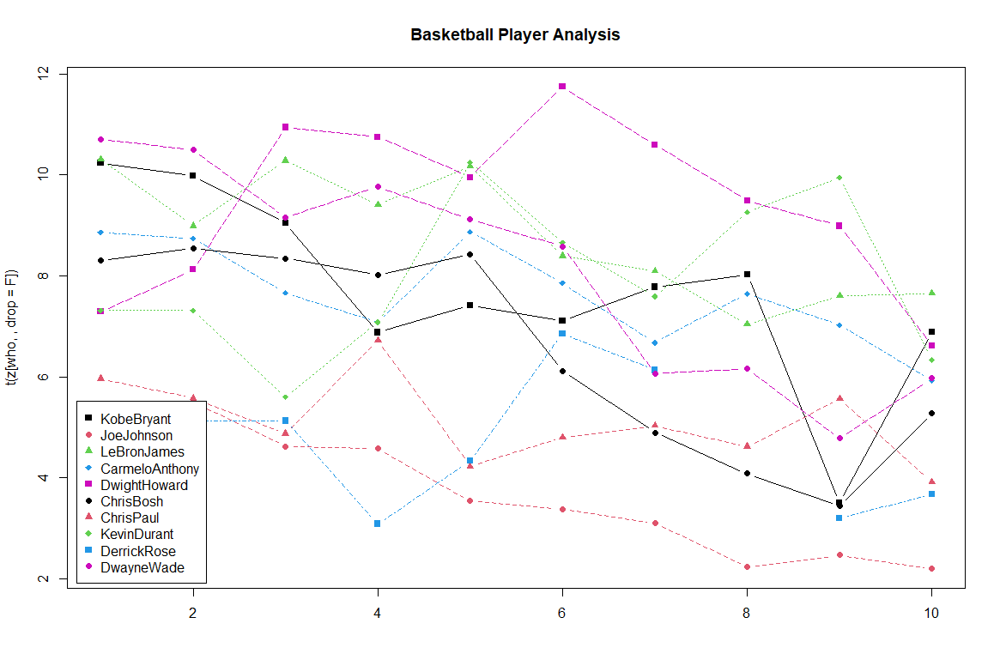
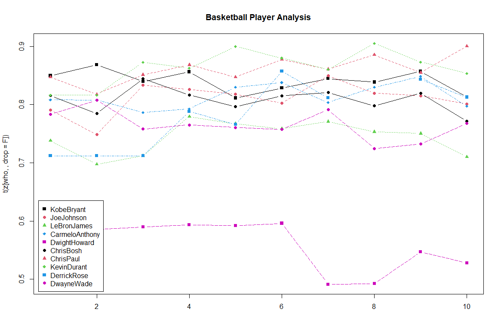
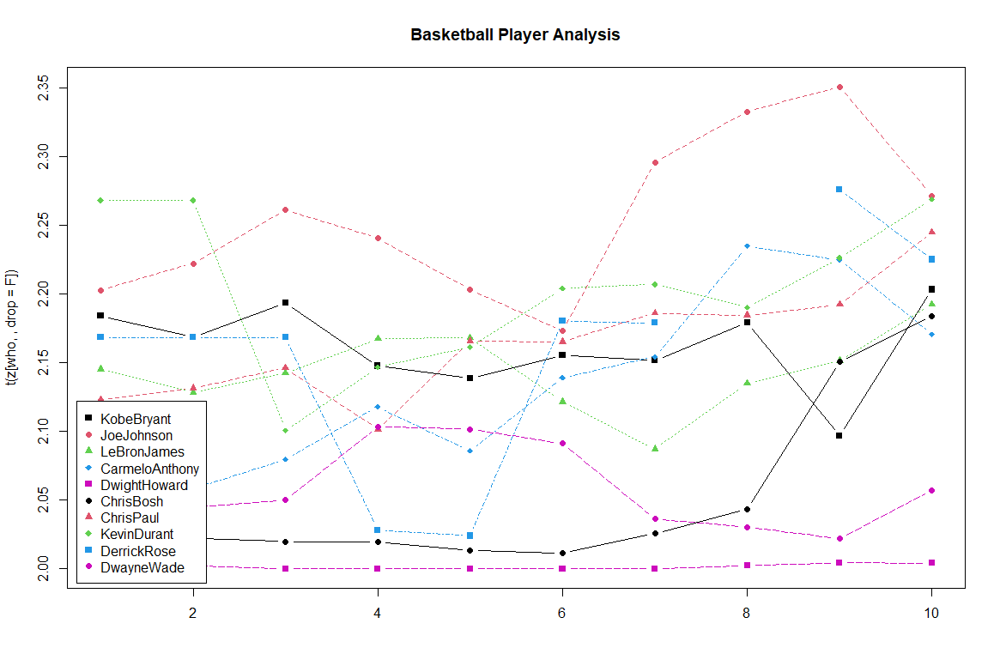

# Homework Section 4

## **Scenario:**
You have been supplied data for two more additional in-game statistics:

* Free Throws
* Free Throw Attempts

You need to create three plots that portray the following insights:

* Free Throw Attempts per game
* Accuracy of Free Throws
* Player playing style (2 vs 3 points preference) excluding Free Throws

Each Free Throw is worth 1 point
The data has been supplied in the form of vectors. You will have to create the two
matrices before you proceed with the analysis

## **My resulting 3 graphs**:
Free Throw attempts per game

Accuracy of Free Throws

Player Playing Style
