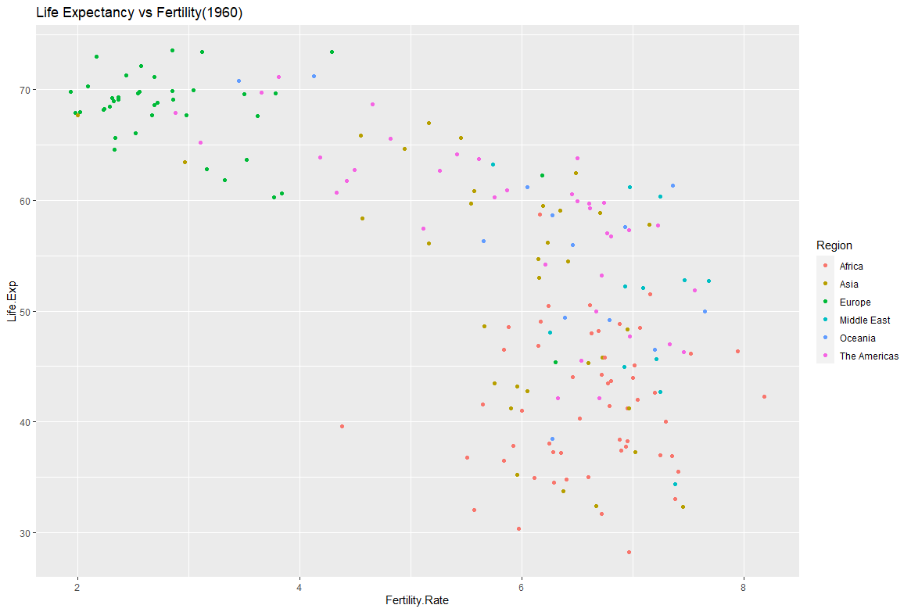
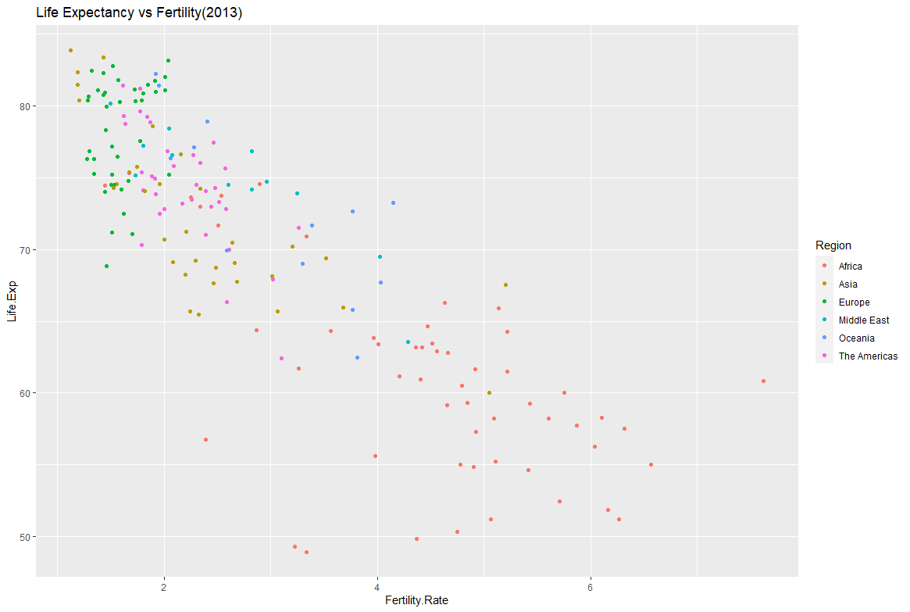

# Homework section 5

## **Scenario:**

The World Bank was very impressed with your deliverables on the previous assignment and they have a new project for you.
You are required to produce a scatterplot depicting Life Expectancy (y-axis) and Fertility Rate (x-axis) statistics by Country.
The scatterplot needs to also be categorised by Countries’ Regions.
You have been supplied with data for 2 years: 1960 and 2013 and you are required
to produce a visualisation for each of these years.
Some data has been provided in a csv file, some - in R vectors. The csv file contains
combined data for both years. All data manipulations have to be performed in R (not
in excel) because this project may be audited at a later stage.
You have also been requested to provide insights into how the two periods compare

## **My result graphs:**
### 1960

### 2013
