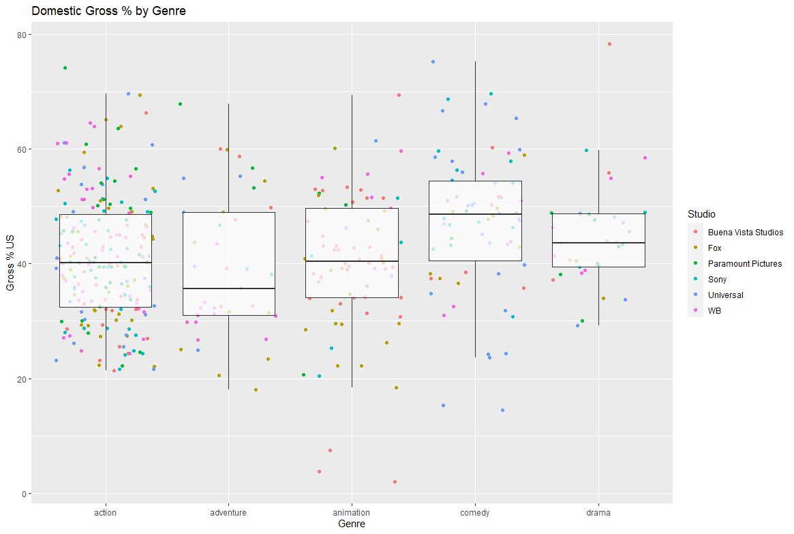

# Homework Section 6

## **Scenario:**
The movie reviews website was very happy with your deliverable for the previous
assignment and now they have a new request for you.
The previous consultant had created a chart for them which is illustrated on the next
slide. However, the R code used to create the diagram has since been lost and cannot
be recovered. Your task is to come up with the code that will re-create the same
chart making it look as close as possible to the original.
A new dataset has been supplied.

## **My Resulting Graph:**
